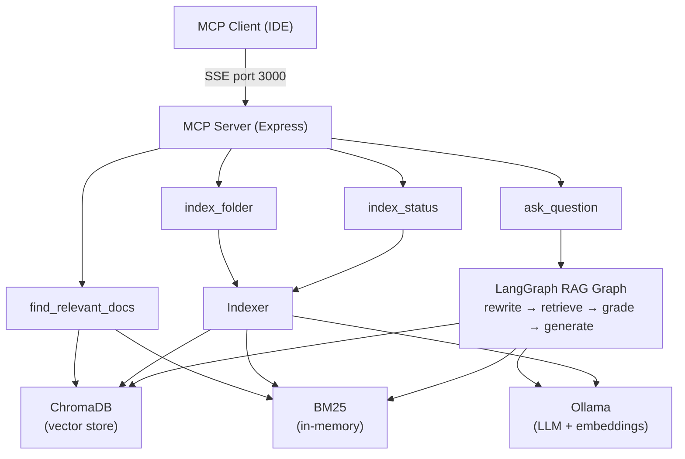
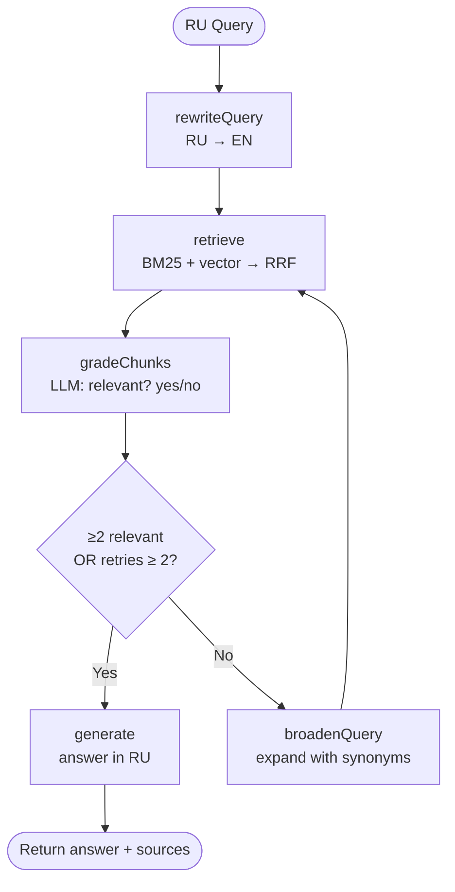

# Architecture

## Overview

MCP server built with TypeScript and Express. Exposes 4 tools over SSE transport.
Implements Corrective RAG pattern using LangGraph for orchestration.

## Components

## Corrective RAG Flow

## Hybrid Search

BM25 (keyword) + ChromaDB vector search → Reciprocal Rank Fusion (k=60).
BM25 index is held in memory and rebuilt from ChromaDB on server startup.
